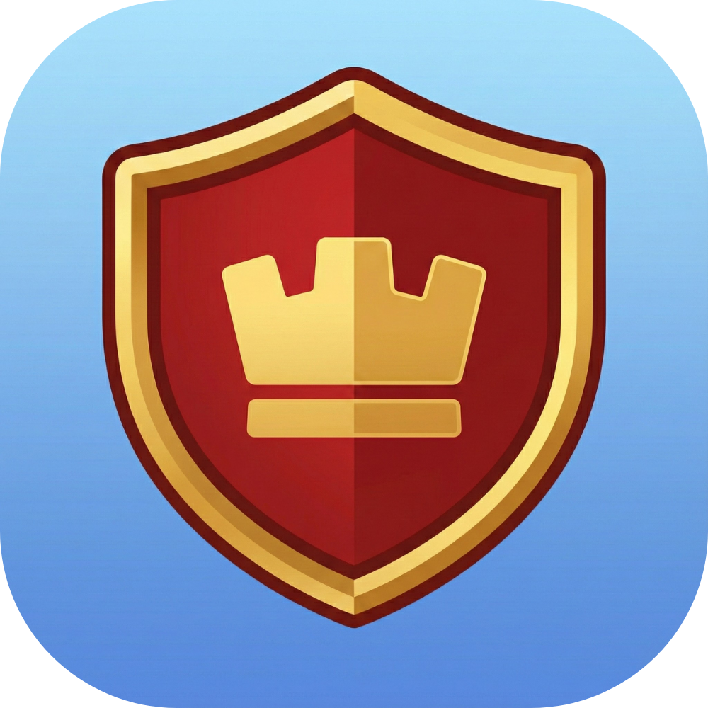
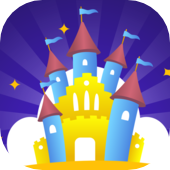

# Hello there 👋

Currently working as Java developer, I also develop mobile apps.

## 📱 my main apps

**Clash Hub**
Flutter mobile app gathering tools and features around Clash of Clans.
Downloads: [iOS](https://apple.com) or [Android](https://google.com)!

 

---

**Version 2.0 of my app called My Park Journey is now available on Android & iOS!**  
More information [here](https://mgt-bros.com/myparkjourney)!  
Downloads [here](https://mgt-bros.com/myparkjourney/downloads/)! Don't hesitate to send me feedbacks!

 

---

**My second app CinéMate is now available on Android & iOS!**  
More information [here](https://mgt-bros.com/cinemate)!  
Downloads: [iOS](https://apps.apple.com/us/app/cinémate/id6502531851) or [Android](https://play.google.com/store/apps/details?id=com.mgtbros.movie_partners)! Don't hesitate to send me feedbacks!

 

## 🌐 more apps

**Find all my apps and projects on my website and don't hesitate to send me feedback!**  
👉 [MGT Bros website](https://mgt-bros.com)

## 🛠️ tech stack

I work mainly with [Flutter](https://flutter.dev/) and [Dart](https://dart.dev/).
I'm curious and motivated by AI !

*Private repos for my mobile projects, public for my studies.*
